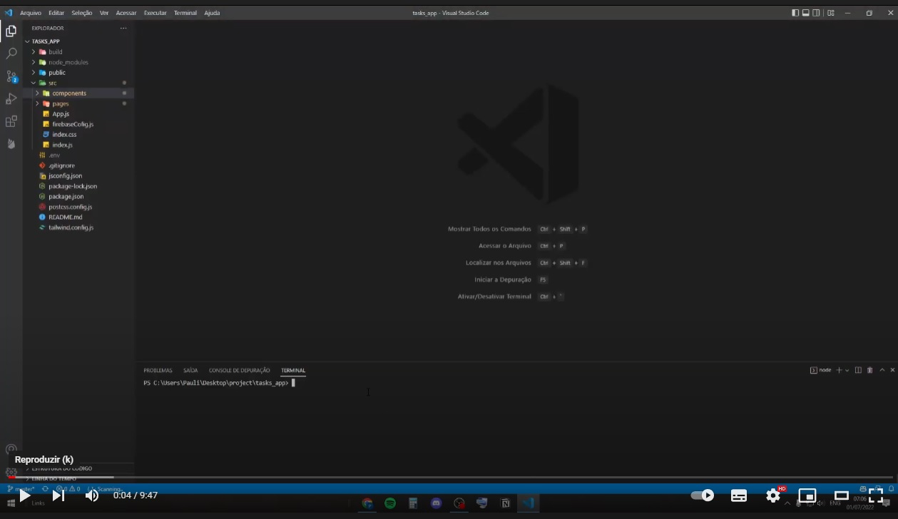

## - Serveless Todo WebApp / - App de tarefas com Backend serverless
<br />


##  - English - 

🌟Hello!🌟

Welcome to my page!

I was recently been involved in a paid project for the first time since I started my journey in programming. As I couldn’t showcase my progress and final results here, I decided to create a simple app to showcase what I’ve learned with this project and how I can apply these skills

You can watch a short clip on Youtube (I must advise you - I normally work on my projects late at night and English is not my first language so please excuse me if my accent is heavy or if I sound tired lol):


[](https://youtu.be/t1uPcsH0cVs "Youtube video")

Link for the live app [HERE](https://task-app-23bd2.web.app/) 
 
Something I mentioned in my video is, I only started programming around mid-April 2022 and I didn’t even know what react was. All I had was the willingness to learn. Then I was invited to lead on a paid project with little to zero knowledge because they were impressed with how much I had learned by myself, within my own time and out of my own interest. 
I was glad to have given this opportunity but it was incredibly challeging due to the lack of knowledge. However, I pressed on, invested a lot of time into learing about the different libraries, features, languages and project managemen to get where I am today and I’m proud of my progress so far. 
As I cant show you the project, I made this new one in the past 3 days.  

Let me show you a few things I’ve picked up along the way! 

My first time using Tailwind css! 

👇
```html
 <div 
    className="w-screen h-screen flex justify-center items-center">
    <div 
        className="border-2 border-gray-250 shadow-md flex flex-col items-center p-4 w-[500px] h-[400px] rounded-[50px] justify-evenly bg-white">
        <h1 className="font-bold text-lg">
            Log In
        </h1>
        <form onSubmit={handdleLogin} className="flex flex-col">
        ...
```        
Even though Tailwind can be overwhelming at first, I think it is AWESOME. It allows me to find the styles quickly and apply them directly to the class names.

React router dom!

👇

```jsx
    export default function App() {
    return (
        <>
        <UserContextProvedor>
        <Router>
        <Routes>
            <Route path="/" element={<Login />} />
            <Route path="/Register" element={<Register />} />
            <Route
            path="/Main/:user"
            element={
                <CheckUser>
                    <Main />
                </CheckUser>
            }
            />
            <Route path="/*" element={<ErrorPage />} />
        </Routes>
        </Router>
        </UserContextProvedor>
        </>
    );
    };
    ...
```

Setting up all the routes with react router dom. It almost comes naturally at this point. It makes the app faster and more organised, it has many usefull hooks like useParamams (to transfer parameters using the url), useNavigate (to create anchors from page to page). I set up the main page using params, as each user that logs into the app will have their own page (which will be their token). However, nobody else will be able to access because I made a protection route making the ```` <CheckUser /> ```` component.


👇

```jsx

const CheckUser = ({ children }) => {
const navigate = useNavigate();
const { setUser } = useUserContex();

onAuthStateChanged(auth, (currentUser) => {

    if (currentUser) {
        setUser(currentUser.uid);
    } else {
        navigate("/");
    }
    });

    return children;
};

export default CheckUser;

```
````onAuthStateChanged```` is a firebase functionality that tracks any change to the user’s activities within the App. So, if a user tries to access the page with a diferent token and it isn’t logged in, they will be redirect to the login page. 

Absolute paths:

👇

```jsx
import Login from "pages/Login";
import Main from "pages/Main";
import Register from "pages/Register";
import ErrorPage from "pages/ErrorPage";
import CheckUser from "components/CheckUser";
```
Just setting up this jsconfig.json file:

👇
```JSON

{
"compilerOptions": { "baseUrl": "src" },
"include": ["src"]
}

```

Wich makes all the file pathing inside of your project more clean, clear and scalable to work with more people. So i setup my "src" folder as the beggining point of my project, then i could use the path for everthing based in that folder. 

Firebase:

👇
````

$ firebase init

     ######## #### ########  ######## ########     ###     ######  ########
     ##        ##  ##     ## ##       ##     ##  ##   ##  ##       ##
     ######    ##  ########  ######   ########  #########  ######  ######
     ##        ##  ##    ##  ##       ##     ## ##     ##       ## ##
     ##       #### ##     ## ######## ########  ##     ##  ######  ########

You're about to initialize a Firebase project in this directory:

````

Auth metods for autentication, Firestore for database and firebase hosting to have my project online. One of tha best SaaS that we have around!

UseContext hook for functions, states and component management. Extensive use of useState and other react hooks like useEffect, useRef etc.

👇

```jsx 
const userContext = createContext();

function useUserContex() {
  return useContext(userContext);
}

function UserContextProvedor({ children }) {
    const [textoAtual, setTextoAtual] = useState("");
    const [tasks, setTasks] = useState([]);
    const [email, setEmail] = useState("");
    const [password, setPassword] = useState("");
    const [user, setUser] = useState("");
    const [error, setError] = useState("");

    const signInUser = () => {
        createUserWithEmailAndPassword(auth, email, password)
        .then((credential) => {
            setUser(credential.user.uid);
            ...

    <userContext.Provider
      value={{
        email, setEmail,
        password, setPassword,
        ...
      }}>
      {children} 
    </userContext.Provider>  


```
Setup a context, exporting the provider ( an wraping the whole app with it) and made a custom hook to import and use the context to other components but, just the necessary. 

👇

```jsx

export default function Main() {

  const {
    textoAtual,
    setTextoAtual,
    tasks,
    handdleAddTask,
    deleteTask,
    getInfos,
    logout,
  } = useUserContex();

  useEffect(() => {
    getInfos();
  }, []);

  ...

  ```

I think thats it! I know i still have alot to learned, but ive enjoyed using react and all those cool libraries. And did some decent progress in 2 months of programing! 

Any sujections, or pull requests.. Be my guest.. or add me on [linkedin](https://www.linkedin.com/in/paulo-faria-a2ba65235/). so we can talk!! =)

Thanks for your time!


##  - Português - 

🌟Olá!🌟

Bem vindo a minha página!

Eu estou desenvolvendo um projeto que acrescenta muito conhecimento a mim. Infelizmente é um projeto pago então não posso mostrar aqui. Então eu fiz um outro projeto mais simples para mostrar um pouco do que eu tenho aprendido.

Você pode assistir um resumo aqui nesse link abaixo. Esta em inglês mas mais pra frente, se houver interesse eu faço um em português.

[](https://youtu.be/t1uPcsH0cVs "Youtube video")
 
Como eu disse no video, eu comecei a programar no meiado de abril então faz 2 meses e meio ( hoje é primeiro de julho ) e quando eu comecei não tinha ideia nem do que se tratava "react". Tive que me virar muito com informação para conseguir desenvolver o projeto e buscar soluções para as funcionalidades pedidas. Foi uma tarefa bem difícil desenvolver algo com quase 0 de conhecimento mas no final ficou muito bom e eu estou muito satisfeito do que consegui fazewr. Então nestes ultimos 3 dias eu fiz esse projeto menor para mostrar um pouco do que eu tenho aprendido. Vou pontuar essas coisas!

Minha primeira vez usando Tailwind Css.

👇
```html
 <div 
    className="w-screen h-screen flex justify-center items-center">
    <div 
        className="border-2 border-gray-250 shadow-md flex flex-col items-center p-4 w-[500px] h-[400px] rounded-[50px] justify-evenly bg-white">
        <h1 className="font-bold text-lg">
            Log In
        </h1>
        <form onSubmit={handdleLogin} className="flex flex-col">
        ...
```  
Mesmo que no começo pareça bem bagunçado e confuso, o tailwind é MUITO BOM. Faz o projeto fluir muito mais rapido pois diretamente no jsx vc pode ir colocando todos os estilos no className.      

React router dom!

👇

```jsx
    export default function App() {
    return (
        <>
        <UserContextProvedor>
        <Router>
        <Routes>
            <Route path="/" element={<Login />} />
            <Route path="/Register" element={<Register />} />
            <Route
            path="/Main/:user"
            element={
                <CheckUser>
                    <Main />
                </CheckUser>
            }
            />
            <Route path="/*" element={<ErrorPage />} />
        </Routes>
        </Router>
        </UserContextProvedor>
        </>
    );
    };
    ...
```
Configurado todas as rotas das pagina com o react router dom. Tenho feito sempre isso em todos projetos que faço. Faz o app ficar mais organizado e rapido. Essa lib tbm possui hooks muito uteis como useParamams (serve para passar parametros atravez da url), useNavigate (para fazer redirecionamento para outras rotas). Eu configurei a main page usando params pois cada pessoa que logar no app vai ter sua propria e exclusiva página ( com base no token ). Mas ninguem vai conseguir acessar uma rota que não seja a dele pois eu configurei uma proteção de rota no componente ``` <CheckUser />``` 

👇

```jsx

const CheckUser = ({ children }) => {
const navigate = useNavigate();
const { setUser } = useUserContex();

onAuthStateChanged(auth, (currentUser) => {

    if (currentUser) {
        setUser(currentUser.uid);
    } else {
        navigate("/");
    }
    });

    return children;
};

export default CheckUser;

```
```onAuthStateChanged``` é um parametro do firebase que fica atualizando a situação do user toda vez que ele loga ou desloga do backend. Então se algum usuario tentar entrar em uma página que não é a dele, ele sera encaminhado para a página de login.

Caminhos absolutos:

👇

```jsx
import Login from "pages/Login";
import Main from "pages/Main";
import Register from "pages/Register";
import ErrorPage from "pages/ErrorPage";
import CheckUser from "components/CheckUser";
```
Apenas configurando este arquivo jsconfig.json
Just setting up this jsconfig.json file:

👇
```JSON

{
"compilerOptions": { "baseUrl": "src" },
"include": ["src"]
}

```

O que faz os caminhos de todos arquivos do projeto mais limpo, claros de entender e deixa o projeto escalavel para se trabalhar com pessoas diferentes. Eu configurei para que a pasta "scr" seja o ponto inicial. Então todos caminhos são baseados nela. 

Firebase:

👇
````

$ firebase init

     ######## #### ########  ######## ########     ###     ######  ########
     ##        ##  ##     ## ##       ##     ##  ##   ##  ##       ##
     ######    ##  ########  ######   ########  #########  ######  ######
     ##        ##  ##    ##  ##       ##     ## ##     ##       ## ##
     ##       #### ##     ## ######## ########  ##     ##  ######  ########

You're about to initialize a Firebase project in this directory:

````

Usei os metodos de auth para autenticação de usuário, firestore para o banco de dados e o serviço de hosting para subir o app para web. Um dos melhores Saas que temos.

UseContext hooks para organizar melhor funções, estados e comonentes. Usei extensivamente os hooks useState, useEffect, useRef e etc. 

👇

```jsx 
const userContext = createContext();

function useUserContex() {
  return useContext(userContext);
}

function UserContextProvedor({ children }) {
    const [textoAtual, setTextoAtual] = useState("");
    const [tasks, setTasks] = useState([]);
    const [email, setEmail] = useState("");
    const [password, setPassword] = useState("");
    const [user, setUser] = useState("");
    const [error, setError] = useState("");

    const signInUser = () => {
        createUserWithEmailAndPassword(auth, email, password)
        .then((credential) => {
            setUser(credential.user.uid);
            ...

    <userContext.Provider
      value={{
        email, setEmail,
        password, setPassword,
        ...
      }}>
      {children} 
    </userContext.Provider>  


```
Criado o contexto, exportado o provider ( que envolveu todas as paginas do app ) e feito um hook proprio para usar o contexto em outras páginas, mas apenas o necessário.

👇

```jsx

export default function Main() {

  const {
    textoAtual,
    setTextoAtual,
    tasks,
    handdleAddTask,
    deleteTask,
    getInfos,
    logout,
  } = useUserContex();

  useEffect(() => {
    getInfos();
  }, []);

  ...

  ```

Acho que é isso. Sei que tenho muito o que aprender e melhorar, mas tenho gostado muito de trabalhar com react e essas bibliotecas. Acredito ter feito um progresso muito bom em 2 meses de programação!

Quaisquer sugestões ou pull requests .. são bemn vindos. Ou me add no [linkedin](https://www.linkedin.com/in/paulo-faria-a2ba65235/) para conversarmos. 

Obrigado pelo seu tempo =)!
